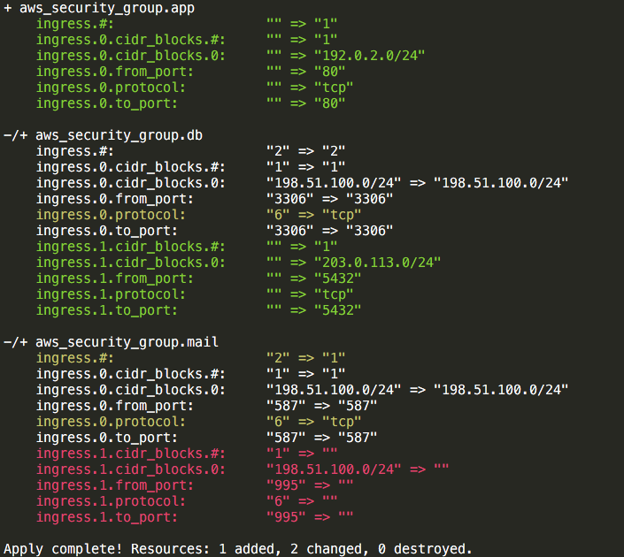

tpdiff
==============================

[](https://travis-ci.org/gongo/tpdiff)

Colorize different lines at execution result of [terraform plan](https://www.terraform.io/docs/commands/plan.html).



USAGE
------------------------------

```
$ terraform plan | tpdiff
```

or

```
$ terraform plan > plan_result.txt
$ # something to do
$ tpdiff plan_result.txt
```


INSTALLATION
------------------------------

```
$ curl -L https://raw.githubusercontent.com/gongo/tpdiff/master/tpdiff > /usr/local/bin/tpdiff
$ chmod +x /usr/local/bin/tpdiff
```

MOTIVATION
------------------------------

It is hard to understand which attributes have been changed.

```
..
.. (message)
..

+ aws_security_group.app
    ingress.#:                   "" => "1"
    ingress.0.cidr_blocks.#:     "" => "1"
    ingress.0.cidr_blocks.0:     "" => "192.0.2.0/24"
    ingress.0.from_port:         "" => "80"
    ingress.0.protocol:          "" => "tcp"
    ingress.0.to_port:           "" => "80"

-/+ aws_security_group.db
    ingress.#:                   "2" => "2"
    ingress.0.cidr_blocks.#:     "1" => "1"
    ingress.0.cidr_blocks.0:     "198.51.100.0/24" => "198.51.100.0/24"
    ingress.0.from_port:         "3306" => "3306"
    ingress.0.protocol:          "6" => "tcp"
    ingress.0.to_port:           "3306" => "3306"
    ingress.1.cidr_blocks.#:     "" => "1"
    ingress.1.cidr_blocks.0:     "" => "203.0.113.0/24"
    ingress.1.from_port:         "" => "5432"
    ingress.1.protocol:          "" => "tcp"
    ingress.1.to_port:           "" => "5432"

-/+ aws_security_group.mail
    ingress.#:                   "2" => "1"
    ingress.0.cidr_blocks.#:     "1" => "1"
    ingress.0.cidr_blocks.0:     "198.51.100.0/24" => "198.51.100.0/24"
    ingress.0.from_port:         "587" => "587"
    ingress.0.protocol:          "6" => "tcp"
    ingress.0.to_port:           "587" => "587"
    ingress.1.cidr_blocks.#:     "1" => ""
    ingress.1.cidr_blocks.0:     "198.51.100.0/24" => ""
    ingress.1.from_port:         "995" => ""
    ingress.1.protocol:          "6" => ""
    ingress.1.to_port:           "995" => ""

Apply complete! Resources: 1 added, 2 changed, 0 destroyed.
```

LICENSE
------------------------------

MIT
